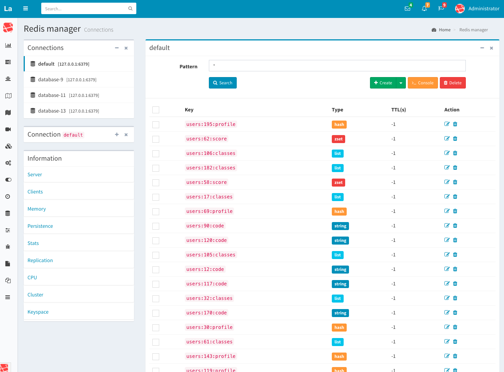

Redis manager for laravel-admin
========================

## Screenshot



## Installation

```
$ composer require lake/lake-redis-manager

$ php artisan admin:import lake-redis-manager
```

Open `http://your-host/admin/lake-redis` in your browser.

License
------------
Licensed under [The MIT License (MIT)](LICENSE).
